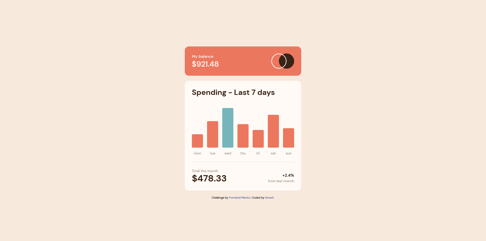

# Frontend Mentor - Expenses chart component solution

This is a solution to the [Expenses chart component challenge on Frontend Mentor](https://www.frontendmentor.io/challenges/expenses-chart-component-e7yJBUdjwt). Frontend Mentor challenges help you improve your coding skills by building realistic projects. 

## Table of contents

- [Overview](#overview)
  - [The challenge](#the-challenge)
  - [Screenshot](#screenshot)
  - [Links](#links)
- [My process](#my-process)
  - [Built with](#built-with)
- [Author](#author)

## Overview

### The challenge

Users should be able to:

- View the bar chart and hover over the individual bars to see the correct amounts for each day
- See the current day’s bar highlighted in a different colour to the other bars
- View the optimal layout for the content depending on their device’s screen size
- See hover states for all interactive elements on the page
- **Bonus**: Use the JSON data file provided to dynamically size the bars on the chart

### Screenshot

### Links

- Solution URL: [https://www.frontendmentor.io/solutions/expenses-chart-component-with-html-css-and-js-YWtd8T4BXZ](https://www.frontendmentor.io/solutions/expenses-chart-component-with-html-css-and-js-YWtd8T4BXZ)
- Live Site URL: [https://expenses-chart-d3.netlify.app](https://expenses-chart-d3.netlify.app)

## My process

### Built with

- Semantic HTML5 markup
- Flexbox
- Mobile-first workflow
- JavaScript
- TailwindCss

## Author

- Website - [Portfolio](https://kind-wing-81f39c.netlify.app/)
- Frontend Mentor - [@Dinesh485](https://www.frontendmentor.io/profile/Dinesh485)
- Twitter - [@DineshGhantasa1](https://twitter.com/DineshGhantasa1)

